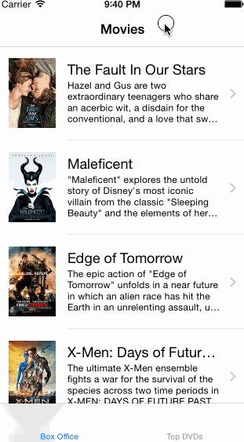

RottenTomatoes
==============

This is the Codepath week1 project RottenTomatoes.

Time spent: 8 hours

Completed user stories:
 * [x] Required: User can view a list of movies from Rotten Tomatoes. Poster images must be loading asynchronously.
 * [x] Required: User can view movie details by tapping on a cell
 * [x] Required: User sees loading state while waiting for movies API. I used MBProgressHUD.
 * [x] Required: User sees error message when there's a networking error.
 * [x] Required: User can pull to refresh the movie list.
 * [x] Optional: For the large poster, load the low-res image first, switch to high-res when complete.
 * [x] Optional: All images should be cached in memory and disk. In other words, images load immediately upon cold start.
 * [x] Optional: Add a tab bar for Box Office and DVD.
 * [x] Optional: Add a search bar.

To install
```
cd RottenTomatoes
pod install
```

Walkthrough of all user storeis:


GIF created with [LiceCap](http://www.cockos.com/licecap/).


